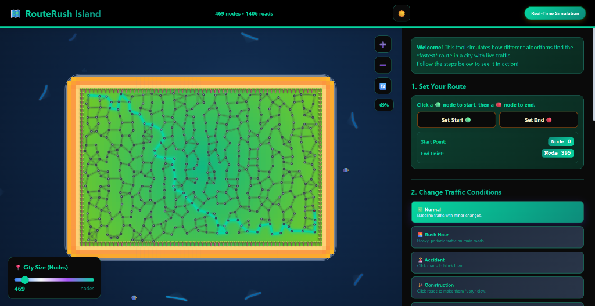

# 🗺️ RouteRush Island – Gamified Pathfinding Simulator


A gamified traffic algorithm simulator desktop application built with Electron and HTML5 Canvas. Visualize and compare different pathfinding algorithms in real-time on a tropical island environment.



If you just want to **use the app** (and not build from source), download a ready-made installer from the **[Releases](https://github.com/VedantKarne/routerush-island/releases)** page on GitHub.

> **Note**: This project is an educational visualization tool. See the **Technical Disclaimer** at the end of this document for important details about the BMSSP implementation.

---

## Table of Contents
- [Features](#-features)
- [Getting Started](#-getting-started)
  - [Download & Run (Recommended)](#option-1--download--run-recommended-for-users)
  - [Build from Source](#option-2--build-from-source-for-developers)
- [Project Structure](#-project-structure)
- [How to Use](#-how-to-use)
- [Technologies Used](#️-technologies-used)
- [Algorithms Implemented](#-algorithms-implemented)
- [Contributing](#-contributing)
- [License](#-license)
- [Keywords](#-keywords)
- [Technical Disclaimer](#️-technical-disclaimer)

---

## ✨ Features

### 🌍 Map Features
- **Interactive Island Map**: Explore a tropical island with roads, buildings, and traffic networks
- **Pan & Zoom**: Click and drag the map, use zoom controls or mouse wheel
- **Dynamic Incident Placement**: Place accidents or construction zones on roads

### 🧠 Algorithm Features
- **Multiple Algorithms**: Compare pathfinding algorithms side-by-side:
  - [Dijkstra's Algorithm](https://en.wikipedia.org/wiki/Dijkstra%27s_algorithm)
  - [Bidirectional Dijkstra](https://en.wikipedia.org/wiki/Bidirectional_search)
  - [Bellman-Ford Algorithm](https://en.wikipedia.org/wiki/Bellman%E2%80%93Ford_algorithm)
  - BMSSP-inspired shortest-path visualization (bounded multi-source shortest paths)*
- **Real-time Visualization**: Watch algorithms solve paths in real-time with color-coded visualizations
- **Performance Metrics**: Track and compare algorithm performance metrics

### 🎮 Simulation Features
- **Dynamic Scenarios**:
  - Normal traffic simulation
  - Emergency routing
  - Accident/construction incident management
  - Random scenario generation
- **Point Selection**: Click on locations to set source/destination

### 🛠 Interaction Features
- **Interactive Controls**: Pan, zoom, and interact with the map using intuitive controls
- **Scenario Selection**: Choose from normal traffic, emergency, or incident scenarios
- **Algorithm Comparison**: Pick one or more algorithms to visualize and compare

### 🔊 Audio Features
- **Immersive Sound Effects**: Audio feedback powered by Tone.js

(*See **Technical Disclaimer** at the end.)

---

## 🚀 Getting Started

### Option 1 – Download & Run (Recommended for Users)

> **📥 Download Link**: **[GitHub Releases](https://github.com/VedantKarne/routerush-island/releases)** ← Click here!

**Quick Download Guide:**

- **Windows users** → download `RouteRush Island Setup 1.0.0.exe`
- **Linux users** → download `RouteRush Island-1.0.0.AppImage`
- **macOS users (Intel)** → download `RouteRush Island-1.0.0.dmg`
- **macOS users (Apple Silicon / M1/M2/M3)** → download `RouteRush Island-1.0.0-arm64.dmg`

---

**Step-by-Step:**

1. **Visit the Releases page**: Go to https://github.com/VedantKarne/routerush-island/releases
2. **Find the latest version**: Look for the most recent release (e.g., v1.0.0)
3. **Download the right file** for your platform (see Quick Download Guide above)
4. **Install**:
   - **Windows**: Double-click the `.exe` file and follow the installer
   - **macOS**: Open the `.dmg` file and drag to Applications folder
   - **Linux**: Make the `.AppImage` executable (`chmod +x RouteRush-Island-1.0.0.AppImage`) and run it
5. **Launch**: Find **RouteRush Island** in your applications menu and start exploring!

> **Note**: No extraction or zip files! Just download the installer for your platform and run it.

### Option 2 – Build from Source (For Developers)

#### Prerequisites

- Node.js (v14 or higher)
- npm or yarn

#### Installation

1. Clone the repository:
```bash
git clone https://github.com/VedantKarne/routerush-island.git
cd routerush-island
```

2. Install dependencies:
```bash
npm install
```

#### Running the Application (Development Mode)

```bash
npm start
```

This will launch the application in development mode with DevTools enabled.

#### Building the Application

The build process includes minification of HTML, CSS, and JavaScript, followed by packaging with Electron Builder to create platform-specific installers (NSIS for Windows, DMG for macOS, AppImage for Linux).

##### Build for all platforms

```bash
npm run build
```

##### Platform-specific builds

```bash
npm run build:win    # Windows
npm run build:mac    # macOS
npm run build:linux  # Linux
```

Built installers will be available in the `release/` folder (local directory, not on GitHub).

---

## 📁 Project Structure

```text
traffic-simulator-desktop/
├── src/                               # Source files
│   ├── Gamified_Traffic_Simulator_Premium.html  # Main application file
│   └── add_dynamic_effects.ps1        # Build helper script
├── dist/                              # Minified/production files
├── release/                           # Built installers (local builds only, excluded from Git)
├── build/                             # Build assets (icons)
├── build-scripts/                     # Build scripts
│   └── minify.js                      # HTML/CSS/JS minification
├── main.js                            # Electron main process
├── package.json                       # Node.js dependencies and scripts
└── README.md                          # This file
```

---

## 🎮 How to Use

1. **Select Points**: Choose source and destination points on the island map
2. **Choose Scenario**: Select from normal traffic, emergency, or incident scenarios
3. **Select Algorithms**: Pick one or more algorithms to compare
4. **Run Simulation**: Click "Find Best Route" to visualize the pathfinding process
5. **Analyze Results**: Review performance metrics and compare algorithm efficiency

**Controls:**
- **Pan**: Click and drag the map
- **Zoom**: Use the zoom controls or mouse wheel
- **Point Selection**: Click on locations to set source/destination
- **Incident Mode**: Place accidents or construction zones on roads

---

## 🛠️ Technologies Used

- **Electron**: Desktop application framework
- **HTML5 Canvas**: For rendering the interactive map
- **Tone.js**: Audio synthesis and sound effects
- **Electron Builder**: Application packaging and distribution
- **HTML Minifier**: Code size optimization for HTML/CSS/JS

---

## 🎨 Algorithms Implemented

### Dijkstra's Algorithm

Single-source shortest path algorithm using a priority queue. Optimal for non-negative weighted graphs.

**Complexity**: O((V + E) log V)

### Bidirectional Dijkstra

Runs Dijkstra from both source and target simultaneously, meeting in the middle for faster results.

**Complexity**: O((V + E) log V) with reduced constant factors

### Bellman-Ford Algorithm

Single-source shortest path that handles negative weights and detects negative cycles.

**Complexity**: O(V × E)

### BMSSP-Inspired Shortest-Path Visualization*

A visualization inspired by the Bounded Multi-Source Shortest Paths algorithm, adapted for educational single-source/single-destination scenarios.

This implementation includes:
- Recursive exploration with frontier shrinking
- Bellman-Ford-style relaxations
- Pivot selection from the current frontier
- Bounded Dijkstra within distance thresholds

*See **Technical Disclaimer** below for important details and limitations.

---

## 🤝 Contributing

Contributions are welcome! Please feel free to submit a Pull Request.

1. Fork the repository
2. Create your feature branch (`git checkout -b feature/AmazingFeature`)
3. Commit your changes (`git commit -m 'Add some AmazingFeature'`)
4. Push to the branch (`git push origin feature/AmazingFeature`)
5. Open a Pull Request

---

## 📄 License

This project is licensed under the MIT License - see the [LICENSE](LICENSE) file for details.

---

## 🙏 Acknowledgments

- Algorithm implementations inspired by classic computer science textbooks and research literature
- Visual design inspired by modern web design trends
- Island theme and tropical aesthetics for an engaging user experience

---

## 📧 Contact

For questions or support, please open an issue on GitHub.

---

## 🔍 Keywords

Pathfinding • Dijkstra • Bellman-Ford • Visualization • Electron • Desktop App • BMSSP • Algorithm Simulator • Traffic Simulation • Shortest Path • Graph Algorithms • Educational Tool

---

<details>
<summary><h2>⚠️ Technical Disclaimer</h2></summary>

RouteRush Island is an **educational visualization and experimentation tool** for shortest-path algorithms.

The BMSSP-related functionality in this project is a **didactic implementation inspired by the BMSSP (Bounded Multi-Source Shortest Paths) algorithm** and its recursive divide-and-conquer structure (source shrinking via Bellman-Ford-style relaxations, pivot selection, and bounded Dijkstra-style searches), as described in the underlying research.

In particular, this implementation:

- Is designed for **interactive, single-source/single-destination** scenarios and small-scale experiments
- Focuses on helping users build intuition about ideas like source-set shrinking, recursive exploration, and bounded searches

It **does not**:

- Implement the full **batch multi-source shortest-path** setting for which BMSSP is formally defined
- Target or realize the theoretical O(m log^(2/3) n) complexity guarantees of the original algorithm
- Replicate all low-level engineering details, parameter tuning, or optimizations required for large-scale batch processing workloads

This project **must not** be interpreted as a production-grade or faithful reimplementation of the BMSSP research algorithm. It is an **educational visualization tool** intended to support learning and intuition-building, not to serve as a reference implementation for research comparisons or benchmarking.

References to **BMSSP** or "BMSSP-inspired" behavior in this repository should be understood in this educational, non-production sense.

</details>

---

**Enjoy exploring pathfinding algorithms with RouteRush Island!** 🏝️🚗
